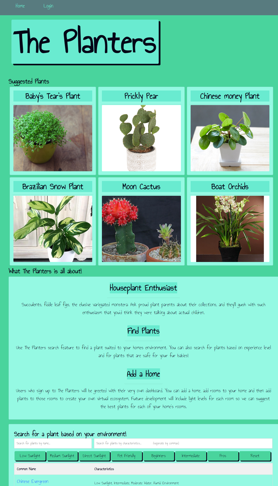

# **The Planters**

## Description

This application uses Node.js and Express.js to create a RESTful api that helps you find plants suitable for your home environment. The application allows you to search the database for a list of common houseplants based on the filters you choose. You will also have the option to create a login to start adding plants that you own to your dashboard and view the information stored for that plant.

## Table of Contents
* [Installation](#installation)
* [Dependencies](#dependencies)
* [Screenshot](#screenshot)
* [Developments](#developments)
* [Contributors](#contributors)

## Installation

If you wish to run this application locally, clone this repository by running `git clone https://github.com/maiyiax/project-2.git` . Then run `npm install` to install the dependencies required to run the application. Additionally, you will need a mysql user login to create the database for seeding the plant information. Once the database is created and seeded, run the application with `npm start` and open in your localhost server to start using the application.

The application can also be used at the deployed link on [Heroku](https://blooming-brook-59963.herokuapp.com/).

## Dependencies

   - [bcrypt](https://www.npmjs.com/package/bcrypt)
   - [bootstrap](https://getbootstrap.com/)
   - [connect-session-sequelize](https://www.npmjs.com/package/connect-session-sequelize)
   - [dotenv](https://www.npmjs.com/package/dotenv)
   - [express](https://www.npmjs.com/package/express)
   - [express-handlebars](https://www.npmjs.com/package/express-handlebars)
   - [express-session](https://www.npmjs.com/package/express-session)
   - [mysql2](https://www.npmjs.com/package/mysql2)
   - [sequelize](https://www.npmjs.com/package/sequelize)
   
## Screenshot

- Homepage 
 

## Developments

- Plans for future developments include the following:
    - Include functionality to assign lighting to rooms. Plants can then be matched to each room based on the light setting in order to determine the best plant suited for that room.
    - Include functionality for a plant watering schedule. Based on the filters you've set on your plant, and the last time you've watered them, we would like for the application to have the ability to send notifications when it is time to water your plants.
    - Increase the plant database to include more plants than just common houseplants.
    - Include toxicity levels for each plant.
    - Include more information for each plant.

## Contributors
* Ricky Pajewski - managed backend processes and connecting the backend to the front end
    - [github](https://github.com/rpajewski)
* Zach Howell - managed front-end processes
    - [github](https://github.com/ZachAH)
* Mai Yia Xiong - managed backend processes and databases
    - [github](https://github.com/maiyiax)
